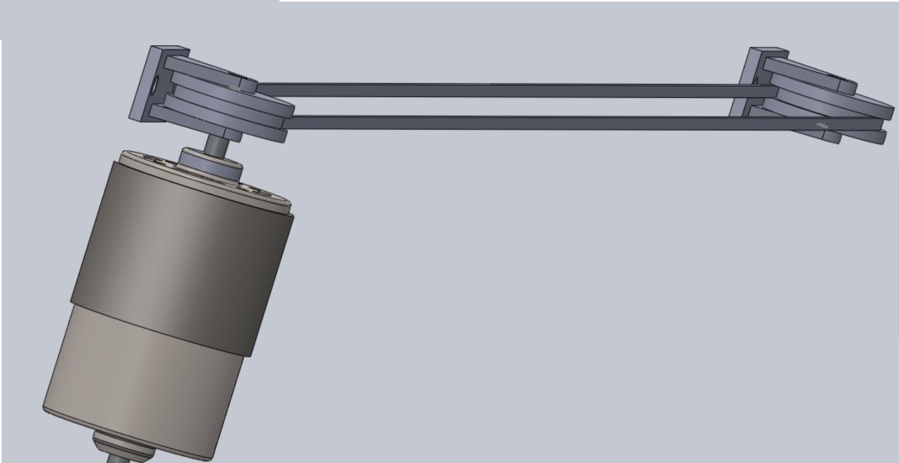
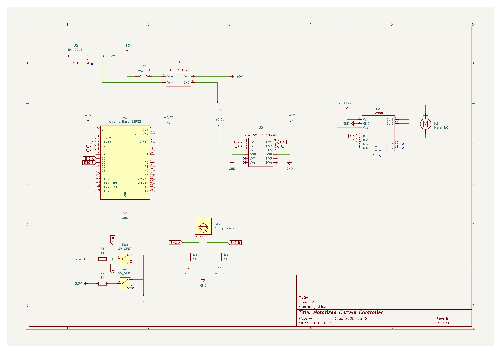

# Smart Curtain Controller

Wifi-Controlled motorized curtain controller. Desgined to be installed on an existing curtain rail, the motor will adjust a pulley system to open and close the curtains. The controller, powered by an Aruino Nano ESP32, hosts the Webserver which the user can connect to with their device, and control the motor.

## CAD

Motor-pulley assembly:

## Circuit Schematic

## Photos
