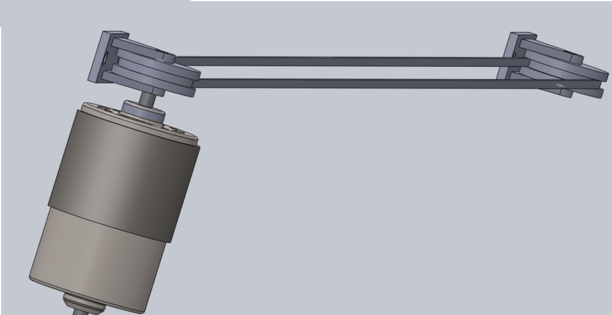
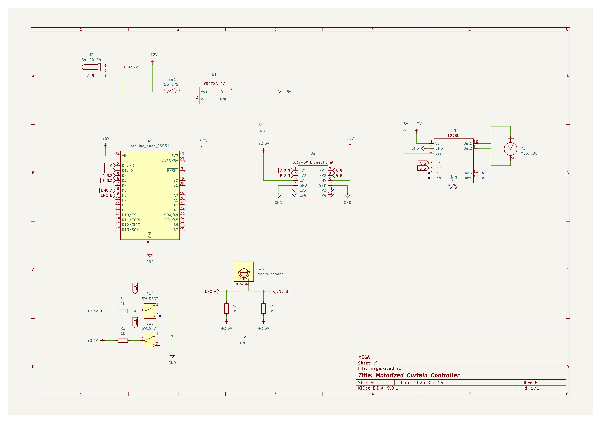

# Smart Curtain Controller

Wifi-Controlled motorized curtain controller. Desgined to be installed on an existing curtain rail, the motor will adjust a pulley system to open and close the curtains. The controller, powered by an Aruino Nano ESP32, hosts the Webserver which the user can connect to with their device, and control the motor.

**Features:**
- Position control using rotary encoder embedded in the active pulley.
- Wifi controlled via webserver hosted on ESP32
- Pulldown limit switches prevent hook going past the edges of the rail
- Bidirectional motor control using H-Bridge driver

## Assembly

Motor-pulley assembly:

Credit to [Eugene Antone](https://www.linkedin.com/in/eugene-antone-64841a256/), [Toni Chevilotte](https://www.linkedin.com/in/antoniuschevillotte/), and [Eddie Gianni Barajas](https://www.linkedin.com/in/eddie-gianni-barajas-a75085277/) for designing, machining, and 3D printing the pulley system.

## Circuit Schematic

Components:
- Arduino Nano ESP32 [Arduino](https://store.arduino.cc/products/nano-esp32?srsltid=AfmBOorIZ8DzsMshaUFfsHBYpZbwMsShYAMtFKwwVgcNaoRBEnJNZBrp)
- 12V-5V Buck Converter: [Amazon](https://www.amazon.com/YRDZXG12V-Adapter-Converter-Reducer-Module%EF%BC%885V/dp/B0CSPTCT2H/ref=sr_1_2_sspa?dib=eyJ2IjoiMSJ9.cTe9h7E764D9ML5ZfcLhbTvNl2dmPI3LkGylawBFpWE7JWToYj6oezx54l6VXqEkFf-0WS8q5cpGT9lcTQ6acRp_4wJY6weAA6oVHLHh0qyFwmLT_f-iaycbQW6VNTn64igBNRXfYw_3LCwjBTIlHMlVbcFVIZl1wFnJWcMit6yJOjzAqhoZj209gJRIDS1A5uaXwKXxxA2zU4tIQJnPJNTSmSkbrUQCDMTTyHTNXrA.q5xDWYr5Gob_ZYpbf8L7HVu1jnvgwP0beh-z8nwJYYU&dib_tag=se&keywords=12v%2Bto%2B5v%2Bvoltage%2Bregulator&qid=1747180835&sr=8-2-spons&sp_csd=d2lkZ2V0TmFtZT1zcF9hdGY&th=1)
- 4x $1\ \mathsf{k\Omega}$ Resistors
- 12V 80RPM DC Motor [Amazon](https://www.amazon.com/BRINGSMART-70kg-cm-Self-locking-Reversed-Rotating/dp/B07F8S57JT/?_encoding=UTF8&pd_rd_w=DNVYP&content-id=amzn1.sym.255b3518-6e7f-495c-8611-30a58648072e%3Aamzn1.symc.a68f4ca3-28dc-4388-a2cf-24672c480d8f&pf_rd_p=255b3518-6e7f-495c-8611-30a58648072e&pf_rd_r=R3AFYKQD539B6QK3PAB1&pd_rd_wg=EomHj&pd_rd_r=7c05e649-c08a-42d2-accf-b8d777b479db&ref_=pd_hp_d_atf_ci_mcx_mr_ca_hp_atf_d&th=1)
- 2x SPDT Limit Switches
- Rotary Encoder
- Barrel Jack Connector 2.10mm [DigiKey](https://www.digikey.com/en/products/detail/tensility-international-corp/54-00164/10459298)
- Wires :)

Custom Symbols designed for:

- 4x4 Bidirectional Level Shifter: [Amazon](https://www.amazon.com/dp/B0CCF6TCSJ?psc=1&smid=A1YZW40LYQY3L1&ref_=chk_typ_imgToDp)
- H-Bridge Driver: [Amazon](https://www.amazon.com/dp/B07PDDZM9L?psc=1&smid=A2ZDGCOOU4F0SF&ref_=chk_typ_imgToDp)

## Photos